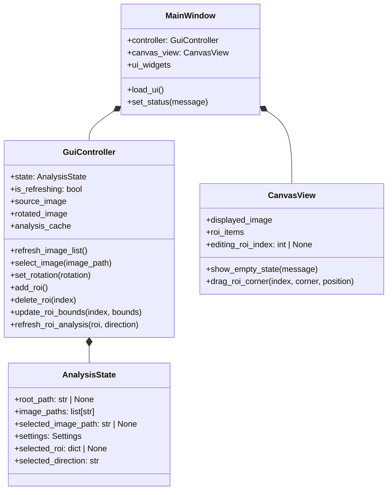

# GUI 구조

## 목적

새 GUI는 좌측 파일 탐색기와 우측 탭 영역을 가진 PyQt 데스크톱 애플리케이션으로 시작한다. 첫 화면은 탐색기 레이아웃과 `Canvas`/`Analysis`/`Settings` 탭 골격만 제공하며, 실제 파일 탐색과 이미지 표시는 후속 구현 범위다.

## 소스 구조

향후 구현은 다음 3파일만 사용한다.

```text
src/
├── fft.py
├── gui.py
└── gui.ui
```

| 파일 | 책임 |
| --- | --- |
| `src/fft.py` | GUI와 독립적인 파일 탐색, 이미지 로딩 및 이후 분석 API를 제공한다. |
| `src/gui.py` | PyQt 애플리케이션 진입점, 창 구성, 상태와 UI 연결을 담당한다. |
| `src/gui.ui` | Qt Designer에서 편집하는 화면 레이아웃 원본이다. |

`src/gui.py`는 `src/fft.py`의 공개 API만 호출한다. `refs/legacy1/` 및 `refs/legacy2/`는 import하지 않는다.

## 계획 클래스 구조

다음 클래스는 향후 `src/gui.py`에 정의할 계획이다. 현재는 설계 계약이며 구현된 클래스가 아니다.



| 클래스 | 책임 |
| --- | --- |
| `MainWindow` | `gui.ui`를 로드하고, 화면 widget을 소유하며, controller가 전달한 상태와 메시지를 표시한다. |
| `GuiController` | 탐색기 이벤트를 처리하고, `AnalysisState`를 갱신하며, `src.fft`의 `compute_*`/`get_*` API 호출을 연결한다. |
| `AnalysisState` | root 경로, 탐색된 데이터 경로와 현재 선택 파일을 보관한다. |
| `CanvasView` | 초기 빈 상태를 표시하고, 후속 단계에서 이미지 및 ROI 렌더링을 담당한다. |

`MainWindow`는 분석 또는 파일 탐색 공식을 직접 구현하지 않는다. `GuiController`만 `src.fft` API를 호출하며, `CanvasView`는 API나 파일 시스템에 직접 접근하지 않는다. Canvas에 그릴 때는 `GuiController`가 `show_*`가 아니라 `draw_*(ax, ...)`를 호출한다. `draw_*`는 `CanvasView`가 소유한 `Axes`에 그리기만 하고 반환값을 쓰지 않기 때문이다.

Settings 탭에서 수정하는 `Settings`의 상세 필드와 소유 규칙은 [FFT API 명세](fft-spec.md)에 정의한다.

## GUI 내부 상태

다음 속성은 화면 동작을 위한 내부 상태다. 사용자 수정 분석 설정은 이 표가 아니라 `AnalysisState.settings`에만 저장한다.

| 클래스 | 내부 속성 | 용도 |
| --- | --- | --- |
| `MainWindow` | `controller`, `canvas_view`, UI widget 참조 | UI 이벤트 연결과 화면 표시 |
| `GuiController` | `state`, `is_refreshing`, `source_image`, `rotated_image`, 선택적 분석 결과 cache | API 호출 순서와 재분석 제어 |
| `CanvasView` | `displayed_image`, `roi_items`, `editing_roi_index` | Canvas 렌더링과 ROI 코너 드래그 상호작용 |

이미지, profile, FFT 및 peak 결과는 재계산 비용이 확인될 때만 `GuiController`의 cache로 보관한다. 같은 설정값을 `MainWindow`, `GuiController`, `CanvasView`에 중복 저장하지 않는다.

## 계획 사용자 흐름

1. 사용자가 폴더를 선택하면 GUI가 `find_image_paths()`로 이미지 파일 목록을 갱신한다.
2. 사용자가 이미지를 선택하면 GUI가 `get_image()` 결과를 `draw_image()`로 Canvas에 표시한다. 회전 방향을 바꾸면 새 `rotation`으로 `get_image()`를 다시 호출한다. 이미지가 처음 로딩되어 `Settings.rois`가 비어 있으면 GUI가 전체 이미지를 덮는 기본 ROI 1개(`xmin=0, xmax=1, ymin=0, ymax=1, label="Total", color="yellow"`)를 자동으로 추가한다.
3. 사용자가 Settings 탭에서 `Add ROI`를 누르면 GUI가 이름과 색을 지정받아 `Settings.rois`에 새 항목(좌표는 기본값 `xmin=0, xmax=1, ymin=0, ymax=1`)을 추가하고, Canvas에 새 ROI 사각형을 겹쳐 그린다.
4. 사용자가 Canvas에서 ROI의 코너 4개 중 하나를 마우스로 드래그하면 GUI가 픽셀 좌표를 정규화 좌표로 변환해 해당 `Settings.rois[i]`를 갱신한다. Settings 탭의 좌표 입력 필드도 같은 값으로 갱신된다. 반대로 Settings 탭에서 좌표를 직접 입력해도 같은 `Settings.rois[i]`가 갱신되어 Canvas 오버레이가 즉시 반영된다. 즉 Canvas 드래그와 Settings 탭 직접 입력은 같은 데이터를 편집하는 두 가지 경로다.
5. 사용자가 Analysis 탭에서 `roiSelector`로 ROI(label로 표시)를 선택하면 GUI가 해당 `Settings.rois[i]` dict를 `AnalysisState.selected_roi`에 저장한다. `directionCombo`로 `horizontal` 또는 `vertical` 방향을 선택하면 `AnalysisState.selected_direction`에 저장한다. `selected_roi`와 `selected_direction`이 모두 있으면 GUI가 `get_roi()`, `compute_raw_profile()`, `compute_norm_profile()`, `compute_fft_spectrum()`, `compute_fft_peaks()`를 순서대로 호출해 dL/L(%) Profile, FFT 및 Top-K peak를 `draw_profiles([norm_profile])`/`draw_spectrums([spectrum])`/`draw_spectrum_peaks()`로 표시한다. `compute_bandpass_profile()`과 `compute_peak2valley()`는 같은 profile을 입력으로 필요할 때 추가로 호출하며, band-pass 결과는 `draw_profiles([norm_profile, bandpass_profile], labels=[...])`로 원본과 겹쳐 표시한다. 이 선택(`AnalysisState.selected_roi`, `selected_direction`)은 Canvas에서 편집 중인 ROI 선택과는 독립적인 상태다. `GuiController.delete_roi(index)`가 `selected_roi`가 참조하는 ROI를 삭제하면 GUI는 `selected_roi`를 `None`으로 초기화하고 `roiSelector`가 빈 선택 상태를 반영하게 한다.

## 화면 계층

메인 창의 central widget은 수평 `QSplitter`다.

```text
QMainWindow
├── QSplitter (horizontal)
│   ├── Explorer panel
│   └── QTabWidget
│       ├── Canvas tab
│       ├── Analysis tab
│       └── Settings tab
└── QStatusBar
```

### 좌측 탐색기

탐색기 영역은 다음 요소를 표시한다.

- root 폴더명을 굵게 표시하는 타이틀 label
- data root 전체 경로 입력 또는 표시 영역 (placeholder `Explorer`)
- `Open`/`Refresh`/`Dark`/`Light` 아이콘 버튼 (가로로 나란히 1행 4열 배치, 표시 텍스트 없이 툴팁으로 안내)
- 검색 파일 수 label
- 단일 선택 파일/폴더 트리 (VSCode Explorer 스타일)

파일 트리는 VSCode Explorer와 동일하게 헤더 없는 단일 컬럼이며 root 하위 폴더 구조를 그대로 반영한다(폴더는 확장/축소 가능한 노드, `.mim` 파일은 리프 노드). 각 노드는 실제 파일/폴더 아이콘을 표시한다. 폴더 노드를 선택해도 이미지 로딩은 일어나지 않는다.

`Dark`/`Light` 버튼은 파일 트리(`fileList`)의 배경/글자/선택 강조 색상 테마를 전환한다. 초기 테마는 `Dark`다.

API 구현 전에는 `Open`, `Refresh`, 파일 트리를 비활성화한다. root 경로의 선택, 파일 검색 및 파일 선택에 따른 이미지 갱신은 후속 구현에서 연결한다.

### 상태표시줄

파일 트리에서 이미지를 선택하면 `QStatusBar`(`statusbar`)에 선택된 파일의 전체 경로, 크기(사람이 읽기 쉬운 단위) 및 수정 날짜(`YYYY-MM-DD HH:MM`)를 표시한다. 이미지 로딩이 실패하면 대신 영문 오류 메시지를 표시한다.

### 우측 탭 영역

우측 영역은 `QTabWidget`이며 `Image`, `Analysis`, `Settings` 세 탭을 둔다. 세 탭 제목은 `analysisTabs`에 설정한 공통 폰트로 통일해 표시한다.

#### Image 탭

- 회전된 이미지 전체와 `Settings.rois`의 모든 ROI를 사각형 오버레이로 표시한다.
- 각 ROI 사각형은 4개의 코너 핸들을 가진다. 사용자가 코너를 마우스로 드래그하면 픽셀 좌표계에서 이동을 처리한 뒤, 이미지 크기 기준으로 정규화 좌표(0~1)로 변환해 해당 `Settings.rois[i]`를 갱신한다. 코너 드래그 상호작용은 후속 stage에서 구현하며, 기본 ROI가 자동 추가된 시점에는 사각형이 표시만 되고 마우스로 편집할 수 없다.
- 초기 내용: 이미지가 아직 없음을 알리는 빈 상태 안내.

#### Analysis 탭

- `roiSelector`(ROI `label`을 표시하는 드롭다운, 인덱스가 아닌 이름으로 선택)와 `directionCombo`(`horizontal`/`vertical` 콤보박스)로 분석 대상을 선택한다.
- 한 번에 선택된 ROI 1개에 대한 dL/L(%) Profile, FFT spectrum 및 peak 결과를 표시한다. 선택된 ROI는 `AnalysisState.selected_roi`(dict), 방향은 `AnalysisState.selected_direction`에 보관하며, 이 상태는 Image 탭에서 편집 중인 ROI와는 독립적이다.

#### Settings 탭

- ROI 목록을 이름과 색으로 표시하고, `Add ROI`/`Delete ROI` 버튼으로 추가·삭제한다. 새 ROI는 이름·색을 지정받고 좌표는 기본값(`xmin=0, xmax=1, ymin=0, ymax=1`)으로 생성된다. `Delete ROI`로 삭제된 ROI가 `AnalysisState.selected_roi`였다면 `selected_roi`는 `None`으로 초기화되고 Analysis 탭 `roiSelector`는 선택 없음 상태가 된다.
- 선택된 ROI의 `xmin`/`xmax`/`ymin`/`ymax` 좌표를 직접 입력할 수 있는 필드를 제공한다. 이 필드를 편집하면 Image 탭의 오버레이도 즉시 갱신된다(Canvas 코너 드래그와 같은 데이터를 편집하는 두 번째 입력 경로).
- `physical_width_mm`, `physical_height_mm`, `rotation`, `averaging_band_size_px`, `reference_band_size_px`, `low_pass_cutoff`, `high_pass_cutoff`, `top_k` 등 전역 분석 설정도 이 탭에서 편집한다.

## UI 계약

`gui.ui`의 widget `objectName`은 `gui.py`가 UI를 연결하는 계약이다. 초기 골격에서는 다음 이름을 예약한다.

| 영역 | `objectName` |
| --- | --- |
| 수평 분할 영역 | `mainSplitter` |
| root 폴더명 타이틀 | `rootTitleLabel` |
| root 경로 | `dataRootEdit` |
| root 선택 버튼 | `browseButton` (아이콘 버튼, 툴팁 `Open folder`) |
| 새로고침 버튼 | `refreshButton` (아이콘 버튼, 툴팁 `Refresh`) |
| 다크 테마 버튼 | `darkThemeButton` (아이콘 버튼, 툴팁 `Dark theme`) |
| 라이트 테마 버튼 | `lightThemeButton` (아이콘 버튼, 툴팁 `Light theme`) |
| 파일 수 | `fileCountLabel` |
| 파일/폴더 트리 | `fileList` |
| 탭 위젯 | `analysisTabs` |
| Image 탭 (표시 텍스트 `Image`) | `canvasTab` |
| Image 빈 상태 | `canvasPlaceholder` |
| Analysis 탭 | `analysisTab` |
| Analysis ROI 선택 | `roiSelector` |
| Analysis 방향 선택 | `directionCombo` |
| Settings 탭 | `settingsTab` |
| ROI 목록 | `roiList` |
| ROI 추가 버튼 | `addRoiButton` |
| ROI 삭제 버튼 | `deleteRoiButton` |
| ROI 이름 입력 | `roiNameEdit` |
| ROI 색 선택 버튼 | `roiColorButton` |
| ROI xmin 입력 | `xminEdit` |
| ROI xmax 입력 | `xmaxEdit` |
| ROI ymin 입력 | `yminEdit` |
| ROI ymax 입력 | `ymaxEdit` |

모든 사용자 표시 문자열, 탭 이름, 버튼 레이블, 상태 및 오류 메시지는 영어로 작성한다.

## 초기 상태와 후속 범위

첫 구현은 창, splitter, 탐색기, Canvas/Analysis/Settings 탭 골격과 빈 상태만 표시한다. `src/fft.py`의 함수는 이 단계에서 호출하지 않는다.

다음 항목은 후속 범위다.

- 실제 root 선택과 파일 목록 갱신
- Canvas 이미지 렌더링과 ROI 코너 드래그 상호작용의 실제 구현(마우스 이벤트 처리, 픽셀·정규화 좌표 변환)
- Settings 탭의 ROI 추가·삭제·좌표 입력 필드와 Canvas 오버레이 간 동기화 구현
- Analysis 탭의 `roiSelector`/`directionCombo` 연결과 분석 파이프라인 호출
- 상태 갱신, 예외 변환 및 분석 결과 표시
