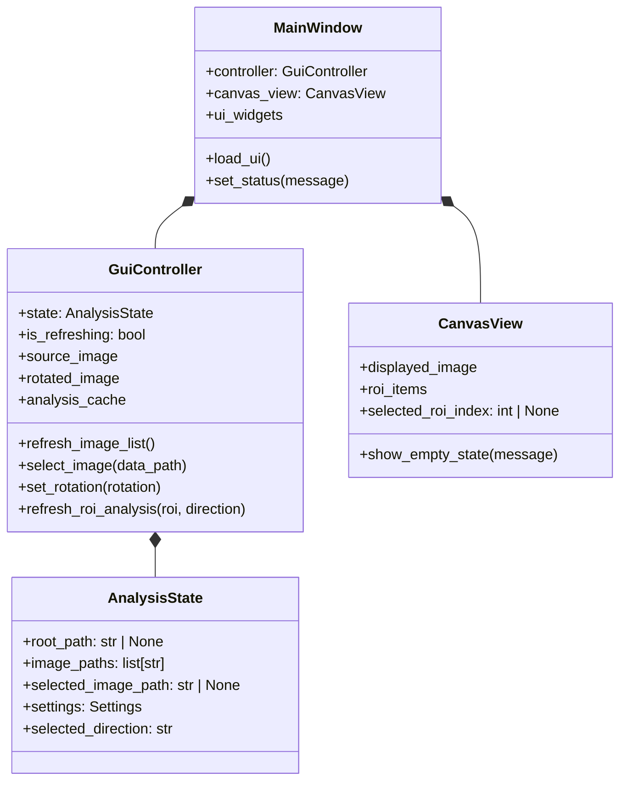

# GUI 구조

## 목적

새 GUI는 좌측 파일 탐색기와 우측 탭 영역을 가진 PyQt 데스크톱 애플리케이션으로 시작한다. 첫 화면은 탐색기 레이아웃과 `Canvas` 탭만 제공하며, 실제 파일 탐색과 이미지 표시는 후속 구현 범위다.

## 소스 구조

향후 구현은 다음 3파일만 사용한다.

```text
src/
├── fft.py
├── gui.py
└── gui.ui
```

| 파일 | 책임 |
| --- | --- |
| `src/fft.py` | GUI와 독립적인 파일 탐색, 이미지 로딩 및 이후 분석 API를 제공한다. |
| `src/gui.py` | PyQt 애플리케이션 진입점, 창 구성, 상태와 UI 연결을 담당한다. |
| `src/gui.ui` | Qt Designer에서 편집하는 화면 레이아웃 원본이다. |

`src/gui.py`는 `src/fft.py`의 공개 API만 호출한다. `refs/legacy1/` 및 `refs/legacy2/`는 import하지 않는다.

## 계획 클래스 구조

다음 클래스는 향후 `src/gui.py`에 정의할 계획이다. 현재는 설계 계약이며 구현된 클래스가 아니다.



| 클래스 | 책임 |
| --- | --- |
| `MainWindow` | `gui.ui`를 로드하고, 화면 widget을 소유하며, controller가 전달한 상태와 메시지를 표시한다. |
| `GuiController` | 탐색기 이벤트를 처리하고, `AnalysisState`를 갱신하며, `src.fft` 공개 API 호출을 연결한다. |
| `AnalysisState` | root 경로, 탐색된 데이터 경로와 현재 선택 파일을 보관한다. |
| `CanvasView` | 초기 빈 상태를 표시하고, 후속 단계에서 이미지 및 ROI 렌더링을 담당한다. |

`MainWindow`는 분석 또는 파일 탐색 공식을 직접 구현하지 않는다. `GuiController`만 `src.fft` API를 호출하며, `CanvasView`는 API나 파일 시스템에 직접 접근하지 않는다.

Settings 탭에서 수정하는 `Settings`의 상세 필드와 소유 규칙은 [FFT API 명세](fft-spec.md)에 정의한다.

## GUI 내부 상태

다음 속성은 화면 동작을 위한 내부 상태다. 사용자 수정 분석 설정은 이 표가 아니라 `AnalysisState.settings`에만 저장한다.

| 클래스 | 내부 속성 | 용도 |
| --- | --- | --- |
| `MainWindow` | `controller`, `canvas_view`, UI widget 참조 | UI 이벤트 연결과 화면 표시 |
| `GuiController` | `state`, `is_refreshing`, `source_image`, `rotated_image`, 선택적 분석 결과 cache | API 호출 순서와 재분석 제어 |
| `CanvasView` | `displayed_image`, `roi_items`, `selected_roi_index` | Canvas 렌더링과 ROI 상호작용 |

이미지, profile, FFT 및 peak 결과는 재계산 비용이 확인될 때만 `GuiController`의 cache로 보관한다. 같은 설정값을 `MainWindow`, `GuiController`, `CanvasView`에 중복 저장하지 않는다.

## 계획 사용자 흐름

1. 사용자가 폴더를 선택하면 GUI가 `list_image_paths()`로 이미지 파일 목록을 갱신한다.
2. 사용자가 이미지를 선택하면 GUI가 `read_image()` 결과를 표시하고, 회전 방향 선택 시 `rotate_image()` 결과를 Canvas에 표시한다.
3. 회전 후 사용자가 ROI와 `x` 또는 `y` 방향을 선택하면 GUI가 `extract_profile()`, `compute_fft()`, `find_fft_peaks()`를 순서대로 호출해 Profile, FFT 및 Top-K peak를 표시한다.

## 화면 계층

메인 창의 central widget은 수평 `QSplitter`다.

```text
QMainWindow
├── QSplitter (horizontal)
│   ├── Explorer panel
│   └── QTabWidget
│       └── Canvas tab
└── QStatusBar
```

### 좌측 탐색기

탐색기 영역은 다음 요소를 표시한다.

- data root 경로 입력 또는 표시 영역
- `Browse` 버튼
- `Refresh` 버튼
- 검색 파일 수 label
- 단일 선택 파일 목록

API 구현 전에는 `Browse`, `Refresh`, 파일 목록을 비활성화한다. root 경로의 선택, 파일 검색 및 파일 선택에 따른 이미지 갱신은 후속 구현에서 연결한다.

### 우측 탭 영역

우측 영역은 `QTabWidget`이며 첫 단계에서는 `Canvas` 탭 하나만 둔다.

- 탭 레이블: `Canvas`
- 초기 내용: 이미지가 아직 없음을 알리는 빈 상태 안내
- 후속 범위: 회전된 이미지 렌더링, ROI overlay 및 상호작용

## UI 계약

`gui.ui`의 widget `objectName`은 `gui.py`가 UI를 연결하는 계약이다. 초기 골격에서는 다음 이름을 예약한다.

| 영역 | `objectName` |
| --- | --- |
| 수평 분할 영역 | `mainSplitter` |
| root 경로 | `dataRootEdit` |
| root 선택 버튼 | `browseButton` |
| 새로고침 버튼 | `refreshButton` |
| 파일 수 | `fileCountLabel` |
| 파일 목록 | `fileList` |
| 탭 위젯 | `analysisTabs` |
| Canvas 탭 | `canvasTab` |
| Canvas 빈 상태 | `canvasPlaceholder` |

모든 사용자 표시 문자열, 탭 이름, 버튼 레이블, 상태 및 오류 메시지는 영어로 작성한다.

## 초기 상태와 후속 범위

첫 구현은 창, splitter, 탐색기, Canvas 탭과 빈 상태만 표시한다. `src/fft.py`의 함수는 이 단계에서 호출하지 않는다.

다음 항목은 후속 범위다.

- 실제 root 선택과 파일 목록 갱신
- Canvas 이미지 렌더링
- ROI 생성, 선택, 이동 및 크기 변경
- Profile, FFT, Settings 등 추가 탭
- 상태 갱신, 예외 변환 및 분석 결과 표시
