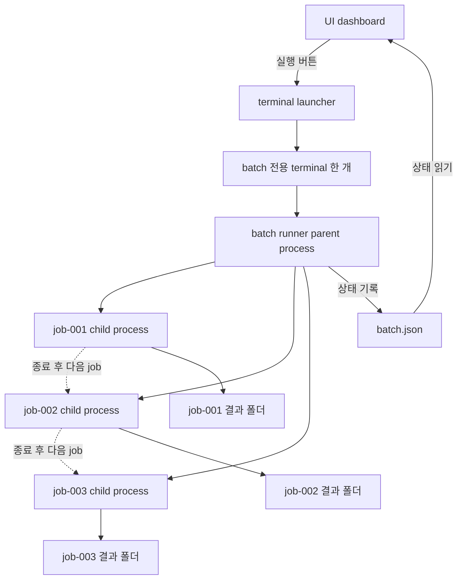
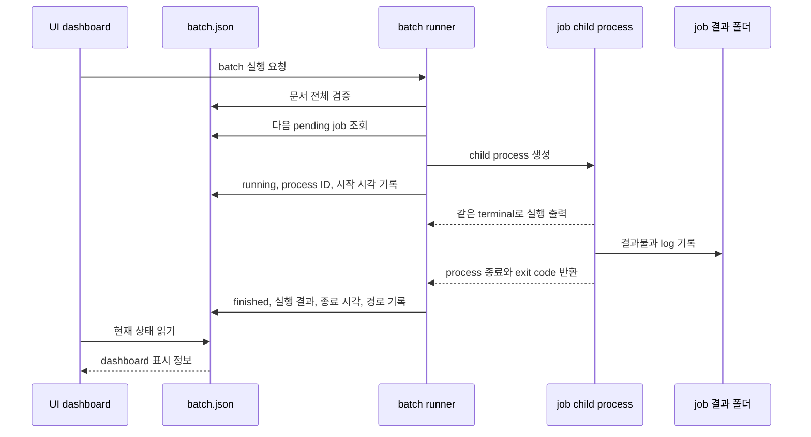

# batch process와 상태 기록 주체

## 문서 목적

이 문서는 하나의 batch를 실행할 때 terminal, terminal launcher, batch runner, 개별 job process, batch JSON, UI dashboard와 결과 폴더가 각각 무엇을 담당하는지 정리한다.

## 핵심 원칙

- 하나의 batch는 하나의 terminal에서 실행한다.
- batch runner는 job마다 새로운 terminal을 열지 않는다.
- batch runner는 parent process이고 각 job CLI는 child process다.
- child process는 parent와 같은 terminal을 사용한다.
- job은 동시에 실행하지 않고 JSON에 기록된 순서대로 하나씩 실행한다.
- batch runner만 batch JSON의 진행 상태를 변경한다.
- 각 job은 자신의 결과 폴더에 결과물과 log를 기록한다.
- UI dashboard는 batch JSON을 읽어 상태를 표시한다.
- AI agent는 실행 과정에 개입하지 않는다.

## process 구조



위 그림의 child process는 구조를 보여주기 위해 나란히 표시했지만 동시에 실행되지 않는다. 앞 job process가 종료된 후 다음 job process를 생성한다.

## 구성요소별 책임

| 구성요소 | 책임 | 하지 않는 일 |
| --- | --- | --- |
| UI dashboard | 조건 선택, batch 생성 요청, 실행 요청, 상태 표시 | terminal 출력 해석, job 실행, JSON 상태 변경 |
| terminal launcher | UI 요청으로 terminal 한 개 실행, batch 종료 후 terminal 유지 | job 순서 결정, 성공과 실패 판정 |
| terminal | 사용자에게 표준 출력과 오류 출력을 보여주는 화면 | JSON 변경, job 상태 판단 |
| batch runner | JSON 검증, 다음 job 선택, child process 실행, 종료 결과 확인, JSON 상태 변경 | model 학습·평가·추론 수행 |
| job child process | 하나의 train, evaluate 또는 predict 작업 수행 | batch의 다음 job 선택, batch JSON 변경 |
| batch JSON | job 정의, 순서, 상태, 결과와 log 경로 보관 | 실제 결과물과 전체 log 내용 보관 |
| job 결과 폴더 | 해당 job의 결과물, log와 resolved 설정 보관 | 다른 job의 상태 관리 |

## 실행 시작 경로

사용자가 기존 terminal에서 직접 실행할 수 있다.

```text
기존 terminal
└── cv-runner --file batch.json run
```

UI에서 실행 버튼을 누르면 terminal launcher가 batch 전용 terminal을 한 번만 연다.

```text
UI dashboard
└── terminal launcher
    └── 새 terminal 한 개
        └── cv-runner --file batch.json run
```

두 경로 모두 batch runner 이후의 실행 구조는 같다.

## 한 job의 상태 기록 시점



상태는 log 문장을 분석하여 판정하지 않는다. batch runner가 child process의 생성 성공과 종료 코드를 기준으로 기록한다.

상태와 실행 결과는 다음과 같이 구분한다.

| 구분 | 값 | 의미 |
| --- | --- | --- |
| `state` | `pending` | child process를 아직 생성하지 않음 |
| `state` | `running` | child process가 생성되어 실행 중 |
| `state` | `finished` | child process가 종료됨 |
| `result` | `null` | 아직 실행 결과가 없음 |
| `result` | `succeeded` | child process가 exit code 0으로 종료됨 |
| `result` | `failed` | child process가 0이 아닌 exit code로 종료되거나 실행 예외가 발생함 |

## JSON과 log 기록 경계

batch runner는 batch JSON의 유일한 writer다. UI와 job child process는 batch JSON을 변경하지 않는다.

batch JSON에는 상태를 확인하고 결과를 찾는 데 필요한 정보만 기록한다.

```json
{
  "id": "job-001",
  "state": "finished",
  "result": "succeeded",
  "process_id": 12345,
  "started_at": "2026-09-08T14:30:00+09:00",
  "finished_at": "2026-09-08T14:35:20+09:00",
  "exit_code": 0,
  "result_dir": "results/batch-001/job-001",
  "log_path": "results/batch-001/job-001/job.log",
  "error": null
}
```

실제 실행 출력, epoch별 기록과 결과물은 job 결과 폴더에 저장한다. terminal은 같은 내용을 사용자가 실시간으로 확인하는 화면이다.

## 실패 후 다음 job 실행

job process가 실패해도 batch runner process는 종료하지 않는다.

```text
job-001 실행
-> exit code 0
-> succeeded 기록

job-002 실행
-> exit code 1
-> failed 기록

job-003 실행
-> 계속 실행
```

모든 job을 확인한 뒤 batch runner가 전체 요약을 같은 terminal에 출력한다.

## terminal 종료

마지막 job이 끝나도 terminal을 자동으로 닫지 않는다. batch runner가 전체 완료 상태를 JSON에 기록하고 요약을 출력한 뒤, terminal launcher가 사용자의 확인과 종료를 기다린다.

terminal을 유지하는 책임을 launcher에 두면 사용자가 기존 terminal에서 직접 실행하거나 자동화 테스트를 수행할 때 batch runner 자체가 불필요하게 입력을 기다리지 않는다.
