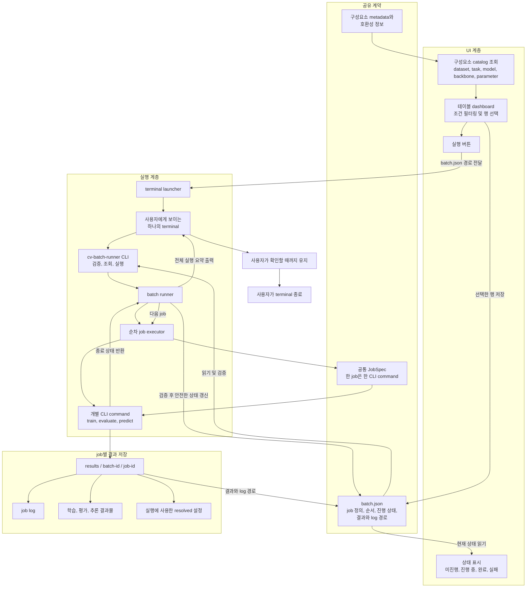
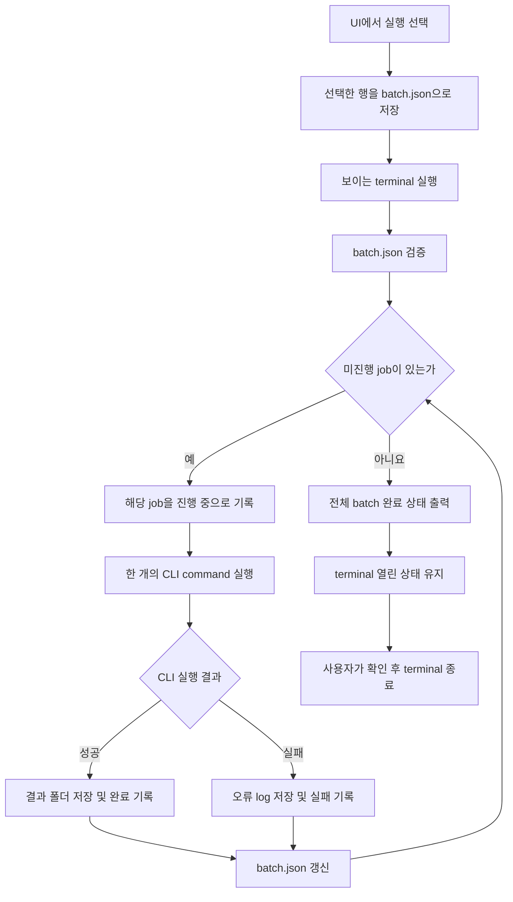
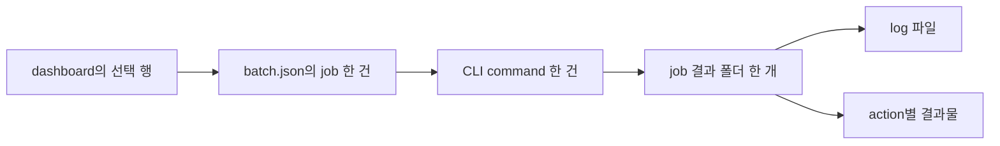

# cv-batch-runner 전체 구조

## 문서 목적

이 문서는 현재까지 확인된 사용자 흐름을 기준으로 UI dashboard, batch JSON, terminal launcher, batch runner, 개별 CLI job과 결과 폴더의 관계를 나타낸다. 세부 interface와 JSON field는 이후 `SPEC.md`에서 확정한다.

AI agent는 이 구조에 포함되지 않는다. 사용자 또는 UI가 실행을 시작하면 runner가 JSON과 CLI process 결과만으로 전체 batch를 진행한다.

## 전체 구조

## batch 실행 흐름

## job과 결과의 대응

하나의 조건에서 train, evaluate, predict를 모두 실행하면 세 개의 job 행과 세 개의 CLI command로 표현한다. 각 job은 다른 job의 성공 여부와 관계없이 자신의 상태와 결과 폴더를 가진다.

## 상태 정보의 소유권

권장 구조에서는 batch runner만 `batch.json`의 진행 상태를 변경하고 UI dashboard는 이를 읽어 표시한다. 같은 파일을 동시에 읽는 동안 불완전한 JSON이 노출되지 않도록 실제 구현에서는 안전한 파일 갱신 방법을 정해야 한다.

terminal 출력은 사용자가 실시간으로 진행 상황을 확인하는 수단이다. dashboard의 상태는 terminal 문자열을 분석하지 않고 `batch.json`에 기록된 job 상태를 기준으로 표시한다.

## 참조 근거

기존 프로젝트의 train, evaluate, predict, batch와 logging 구조에서 확인한 내용은 [previous-project-execution.md](previous-project-execution.md)에 기록했다.

terminal 하나에서 parent runner와 child job을 실행하고 JSON 상태를 기록하는 주체는 [process-and-state-ownership.md](process-and-state-ownership.md)에 정리했다.
